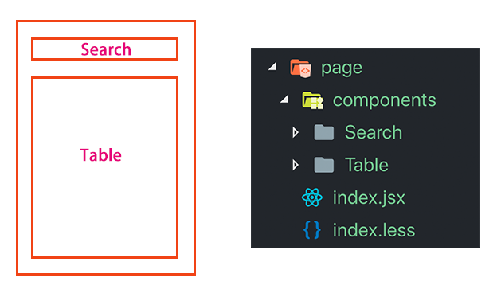

# 代码拆解

> 再复杂的页面，只要你拆的足够细，它便不再复杂

合理的代码拆解尤其重要，能够减少阅读成本、维护成本、代码质量，并能够提高生产效率，一个文件代码过长，上下翻来翻去也要浪费很多时间

并且，对于 React,Vue 等虚拟 DOM 框架，组件拆分得越细，性能越好，因为只要有一个字段发生变动，即使大部分数据没有更改，还是要进行全部比对整个组件

### 一个页面或者一个组件的入口文件代码看起来应该是这样的

```js
// React
import React, { Component } from 'react'
import { observer } from 'mobx-react'

// 框架
import { Button, Select } from 'antd'

// 其他第三方库
import _ from 'loadsh'
import classNames from 'classNames'

// 项目公共库
import utils from 'src/lib/utils'

// 项目公共组件
import Loading from 'src/components/Loading'

// 页面组件
import Search from './Search'
import Table from './Table'

// Mobx Store
import store from './store'

// 样式
import styles from './index.less'

// 图片
import bg from './images/bg.png'

// 变量声明
const Option = Select.Option

@observer
class Home extends Components {
  componentDidMount() {
    store.fetchList()
  }
  render() {
    return (
      <div className={styles.container}>
        <Search />
        <Table />
      </div>
    )
  }
}

export default Home
```

#### 遵循以下原则

##### 1. 按序 import，并在每一种类型后面空一行

> React > 框架 > 其他第三方库 > 项目公共库 > 项目公共组件 > 页面组件 > Mobx Store > 样式 > 变量声明

##### 2. 入口文件保持简洁

入口文件不要直接写业务代码，只负责引入组件和其他一些少量的逻辑判断，数据的请求和处理等数据操作全部放在 store 中

> 除非页面东西很少，代码不多

##### 3. 业务模块与代码模块一一对应



##### 4. 单页面代码行数控制在 300 以内

> 不觉得页面代码过长上下翻页都很费劲吗？

### <span style="color: red;">总之，没有死规则，代码拆解视具体情况而定，尽量做到代码工整、一目了然、单文件代码量少、易阅读、易理解</span>
